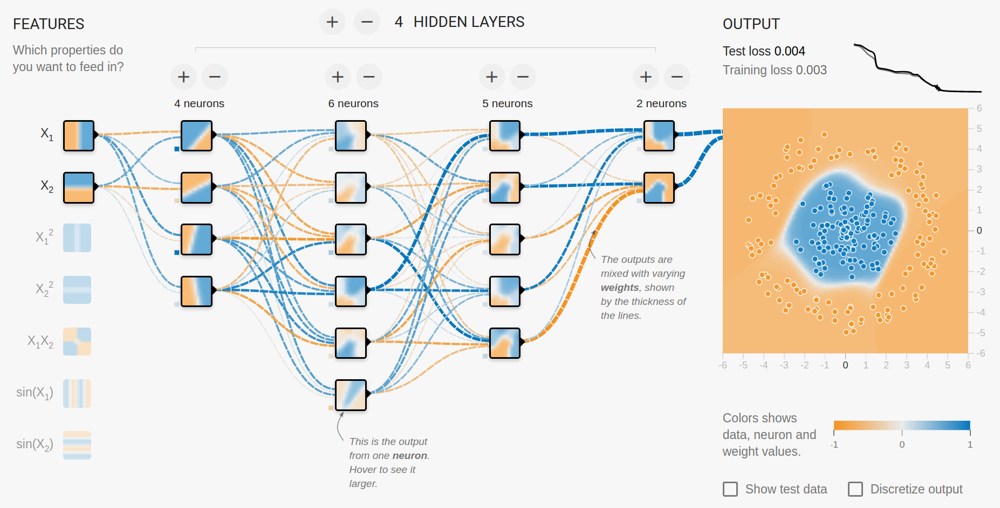
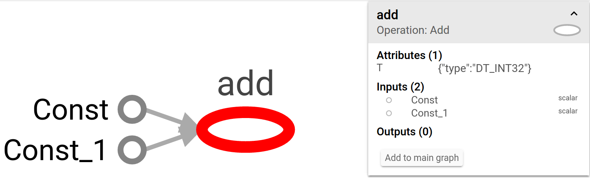
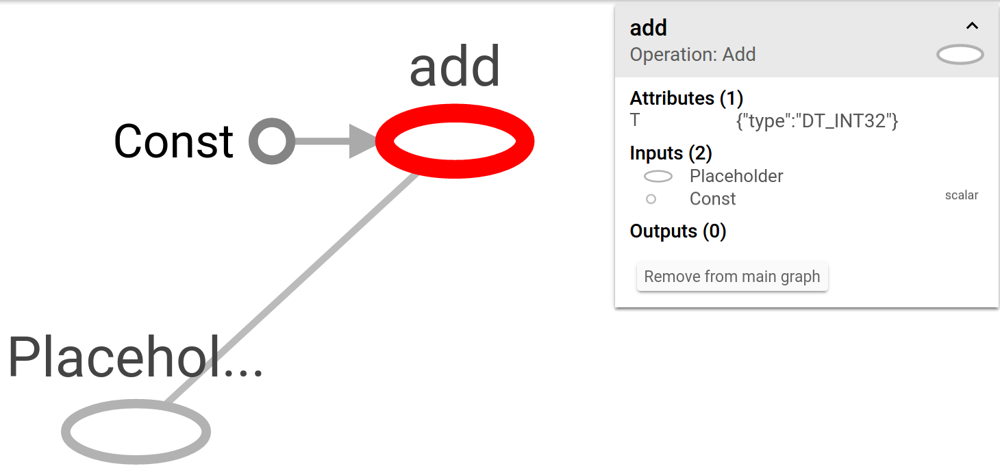
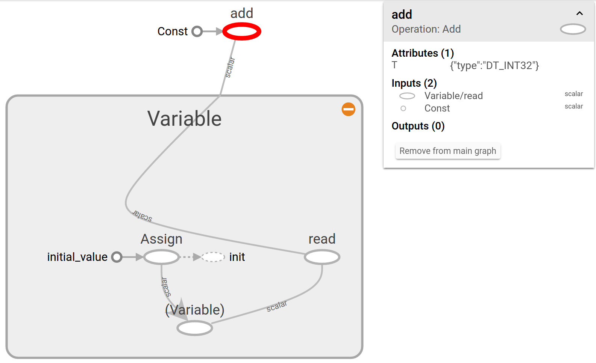
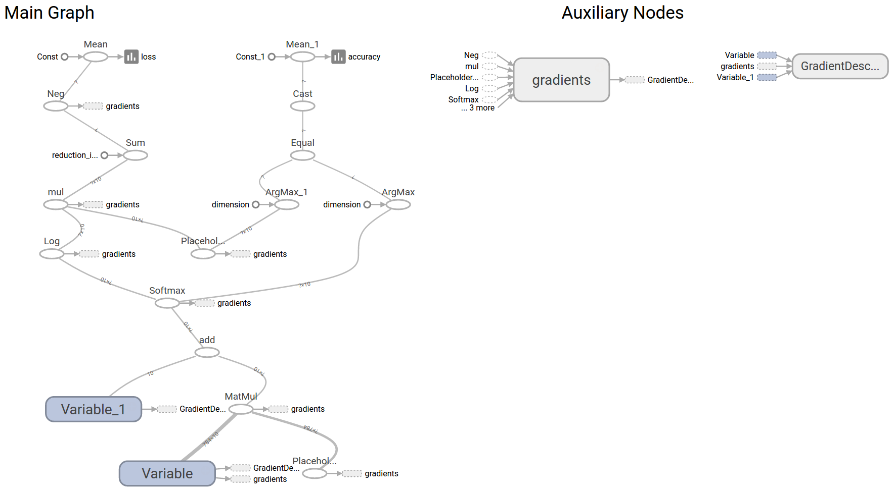
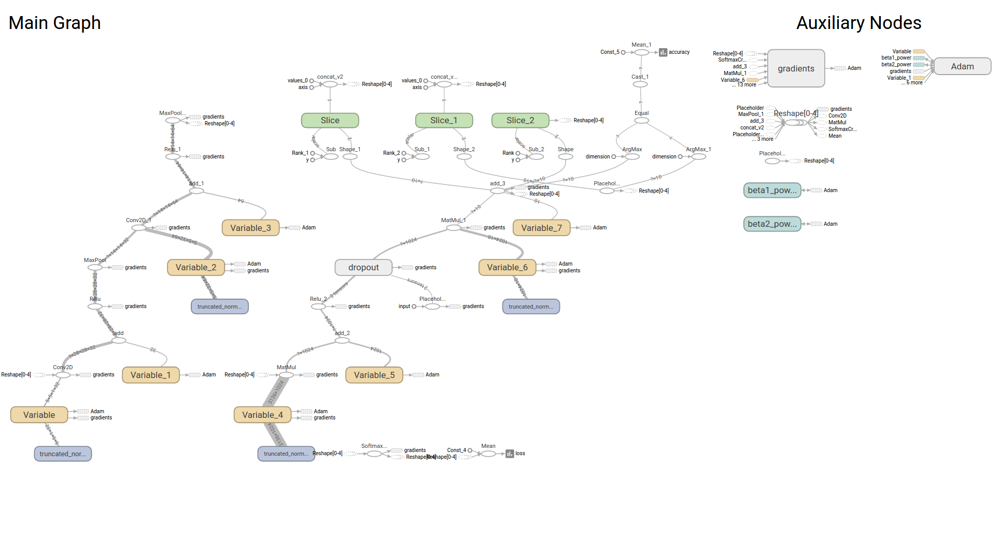

### Introduction to Deep Learning with TensorFlow

Portland, Feb 9, 2017

[Garrett Smith](http://gar1t.com) / [@gar1t](https://twitter.com/gar1t)

<a href="https://guild.ai">

</a>

---

http://playground.tensorflow.org



---

### Graph operations

``` python
> import tensorflow as tf
>
> one = tf.constant(1)
> two = tf.constant(2)
> three = one + two
>
> sess = tf.Session()
> sess.run(three)
3
```

---

### Graph operations

``` python
> sess.graph.get_operations()
[<tf.Operation 'Const' type=Const>,
 <tf.Operation 'Const_1' type=Const>,
 <tf.Operation 'add' type=Add>]
```

---

### Graph operations



---

### Placeholders

``` python
> tf.reset_default_graph()
>
> one = tf.constant(1)
> x = tf.placeholder(tf.int32)
> y = x + one
>
> sess = tf.Session()
> sess.run(y, {x:2})
3
```

---

### Placeholders

``` python
> sess.graph.get_operations()
[<tf.Operation 'Const' type=Const>,
 <tf.Operation 'Placeholder' type=Placeholder>,
 <tf.Operation 'add' type=Add>]
```

---

### Placeholders



---

### Variables

``` python
> tf.reset_default_graph()
>
> one = tf.constant(1)
> x = tf.Variable(2)
> y = x + one
>
> sess = tf.Session()
> sess.run(tf.global_variables_initializer())
> sess.run(x)
2
> sess.run(y)
3
```

---

### Variables

``` python
> sess.graph.get_operations()
[<tf.Operation 'Const' type=Const>,
 <tf.Operation 'Variable/initial_value' type=Const>,
 <tf.Operation 'Variable' type=VariableV2>,
 <tf.Operation 'Variable/Assign' type=Assign>,
 <tf.Operation 'Variable/read' type=Identity>,
 <tf.Operation 'add' type=Add>,
 <tf.Operation 'init' type=NoOp>]
```

---

### Variables



---

### Typical training script

<div class="compact-code-4"></div>

``` python
def train():
    for step in training_steps():
        batch = next_batch()
        sess.run(train, batch)
        maybe_log_accuracy(step, batch)
        maybe_checkpoint_model(step)

if __name__ == "__main__":
    init_flags()
    init_model()
    init_train()
    init_accuracy()
    init_summaries()
    init_session()
    train()
```

---

### Init flags

``` python
def init_flags():
    global FLAGS
    parser = argparse.ArgumentParser()
    parser.add_argument("--rundir", default="./last-run")
    parser.add_argument("--epochs", type=int, default=100)
    FLAGS, _ = parser.parse_known_args()
```

---

### Model (softmax regression)

``` python
def init_model():
    global x, y
    x = tf.placeholder(tf.float32, [None, 784])
    W = tf.Variable(tf.zeros([784, 10]))
    b = tf.Variable(tf.zeros([10]))
    y = tf.nn.softmax(tf.matmul(x, W) + b)

```

---

### Train op (gradient descent)

<div class="compact-code"></div>

``` python
def init_train():
    global y_, loss, train
    y_ = tf.placeholder(tf.float32, [None, 10])
    loss = tf.reduce_mean(
             -tf.reduce_sum(
               y_ * tf.log(y),
               reduction_indices=[1]))
    train = tf.train.GradientDescentOptimizer(0.5).minimize(loss)
```

---

### Accuracy op

<div class="compact-code"></div>

``` python
def init_accuracy():
    global accuracy
    correct_prediction = tf.equal(tf.argmax(y, 1), tf.argmax(y_, 1))
    accuracy = tf.reduce_mean(tf.cast(correct_prediction, tf.float32))
```

---

### Summaries

``` python
def init_summaries():
    global summaries, writer
    tf.summary.scalar("loss", loss)
    tf.summary.scalar("accuracy", accuracy)
    summaries = tf.summary.merge_all()
    writer = tf.summary.FileWriter(FLAGS.rundir + "/train")
```

---

### Initializing the session

``` python
def init_session():
    global sess
    sess = tf.Session()
    sess.run(tf.global_variables_initializer())
```

---

### Logging accuracy

``` python
def log_accuracy(step, batch):
    accuracy_out, summary_out = sess.run(accuracy, batch)
    writer.add_summary(summary_out, step)
    print "Step %i: accuracy=%f" % accuracy_out
```

---

### Checkpointing

``` python
def checkpoint_model():
    saver = tf.train.Saver()
    saver.save(sess, FLAGS.rundir + "/model/export")
```

---

### Full graph (MNIST regression)



---

### Full graph (MNIST CNN)


