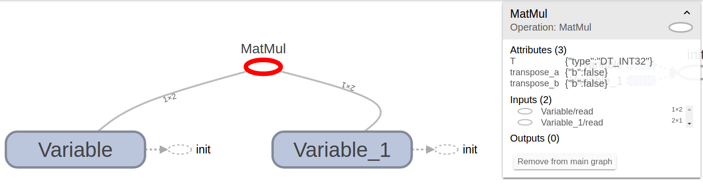

### Introduction to Deep Learning with TensorFlow

Portland, Feb 9, 2017

[Garrett Smith](http://gar1t.com) / [@gar1t](https://twitter.com/gar1t)

<a href="https://guild.ai">

</a>

---

http://playground.tensorflow.org


---

## Code considered instructive

---

https://gar1t.github.io/2017-02-09-portland-ml

https://git.io/vDg9c

---

## TensorFlow = graphs

---

### Graph operations

``` python
> import tensorflow as tf
>
> one = tf.constant(1)
> two = tf.constant(2)
> three = one + two
>
> sess = tf.Session()
> sess.run(three)
3
```

---

### Graph operations

``` python
> sess.graph == tf.get_default_graph()
True
> sess.graph.get_operations()
[<tf.Operation 'Const' type=Const>,
 <tf.Operation 'Const_1' type=Const>,
 <tf.Operation 'add' type=Add>]
```

---

### Graph operations <small>(TensorBoard)</small>


---

### Placeholders

``` python
> tf.reset_default_graph()
>
> one = tf.constant(1)
> x = tf.placeholder(tf.int32)
> y = x + one
>
> sess = tf.Session()
> sess.run(y, {x:2})
3
```

---

### Placeholders

``` python
> sess.graph.get_operations()
[<tf.Operation 'Const' type=Const>,
 <tf.Operation 'Placeholder' type=Placeholder>,
 <tf.Operation 'add' type=Add>]
```

---

### Placeholders <small>(TensorBoard)</small>


---

### Variables

``` python
> tf.reset_default_graph()
>
> one = tf.constant(1)
> x = tf.Variable(2)
> y = x + one
>
> sess = tf.Session()
> sess.run(tf.global_variables_initializer())
> sess.run(x)
2
> sess.run(y)
3
```

---

### Variables

``` python
> sess.graph.get_operations()
[<tf.Operation 'Const' type=Const>,
 <tf.Operation 'Variable/initial_value' type=Const>,
 <tf.Operation 'Variable' type=VariableV2>,
 <tf.Operation 'Variable/Assign' type=Assign>,
 <tf.Operation 'Variable/read' type=Identity>,
 <tf.Operation 'add' type=Add>,
 <tf.Operation 'init' type=NoOp>]
```

---

### Variables <small>(TensorBoard)</small>


---

### Operations <small>(matrix mult)</small>

``` python
> tf.reset_default_graph()
>
> x = tf.Variable([[2,1]])
> y = tf.Variable([[1],[2]])
> z = tf.matmul(x, y)
>
> sess = tf.Session()
> sess.run(tf.global_variables_initializer())
> sess.run(z)
array([[4]], dtype=int32)
```

---

### Operations <small>(TensorBoard)</small>



---

### Graphs = models and their operations

---

## Machine learning

---

### Training script

``` python
def train():
    for step in range(training_steps):
        batch = data.next_batch()
        sess.run(train_op, batch)
        maybe_log_accuracy(step, batch)
        maybe_save_model()

if __name__ == "__main__":
    init_flags()
    init_data()
    init_train()
    train()
```

---

### Flags

``` python
def init_flags():
    global FLAGS
    parser = argparse.ArgumentParser()
    parser.add_argument("--datadir", default="./data")
    parser.add_argument("--rundir", default="./last-run")
    parser.add_argument("--epochs", type=int, default=100)
    FLAGS, _ = parser.parse_known_args()
```

---

## Function defined globals

``` python
def init_foo():
    global foo
    foo = "hello"
```

<ul>
<li class="fragment">TensorFlow encourages global-like state
<li class="fragment">Focused functions separate concerns
<li class="fragment">Manage state without adding noise
</ul>

---

### Data

``` python
def init_data():
    global data
    data = load_data(FLAGS.datadir)
```

---

### Train

``` python
def init_train():
    init_model()
    init_train_op()
    init_accuracy_op()
    init_summaries()
    init_session()
```

---

### Model <small>(softmax regression)</small>

``` python
def init_model():
    global x, y
    x = tf.placeholder(tf.float32, [None, 784])
    W = tf.Variable(tf.zeros([784, 10]))
    b = tf.Variable(tf.zeros([10]))
    y = tf.nn.softmax(tf.matmul(x, W) + b)

```

---

### Train op <small>(gradient descent)</small>

<div class="compact-code"></div>

``` python
def init_train_op():
    global y_, loss, train_op
    y_ = tf.placeholder(tf.float32, [None, 10])
    loss = tf.reduce_mean(
             -tf.reduce_sum(
               y_ * tf.log(y),
               reduction_indices=[1]))
    train_op = tf.train.GradientDescentOptimizer(0.5).minimize(loss)
```

---

### Accuracy op

<div class="compact-code-2"></div>

``` python
def init_accuracy_op():
    global accuracy
    correct_prediction = tf.equal(tf.argmax(y, 1), tf.argmax(y_, 1))
    accuracy = tf.reduce_mean(tf.cast(correct_prediction, tf.float32))
```

---

### Summaries

``` python
def init_summaries():
    global summaries, writer
    tf.summary.scalar("loss", loss)
    tf.summary.scalar("accuracy", accuracy)
    summaries = tf.summary.merge_all()
    writer = tf.summary.FileWriter(FLAGS.rundir + "/train")
```

---

### Session

``` python
def init_session():
    global sess
    sess = tf.Session()
    sess.run(tf.global_variables_initializer())
```

---

### Logging accuracy

<div class="compact-code"></div>

``` python
def log_accuracy(step, batch):
    accuracy_val, summary = sess.run([accuracy, summaries], batch)
    writer.add_summary(summary, step)
    print "Step %i: accuracy=%f" % accuracy_val
```

---

### Saving a model

``` python
def save_model():
    saver = tf.train.Saver()
    saver.save(sess, FLAGS.rundir + "/model/export")
```

---

### Full graph <small>(MNIST regression)</small>


---

### Full graph <small>(MNIST CNN)</small>


---

### Training script <small>(review)</small>

``` python
def train():
    for step in range(training_steps):
        batch = data.next_batch()
        sess.run(train_op, batch)
        maybe_log_accuracy(step, batch)
        maybe_save_model()

if __name__ == "__main__":
    init_flags()
    init_data()
    init_train()
    train()
```

---

# Demo

https://guild.ai

---

## Full TensorFlow Lifecycle

<ul>
<li class="fragment">Get code
<li class="fragment">Prepare model for training
<li class="fragment">Train model
<li class="fragment">Compare results
<li class="fragment">Serve model
</ul>

---

## Deep learning with TensorFlow

<ul>
<li class="fragment">TF is a <strong>low level</strong> library for machine learners
<li class="fragment"><strong>Frameworks</strong> growing in popularity and support <small>(Keras, TFLearn, TFSlim)</small>
<li class="fragment"><strong>Graphs</strong> central <small>(define model &amp; ops, run, export, serve)</small>
</ul>

---

## Links

- http://tensorflow.org
- http://guild.ai
- http://tensorflowpatterns.org
